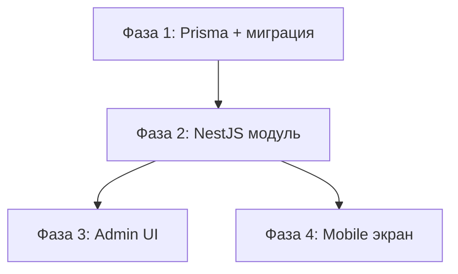

# Plan: Составление плана реализации

## Входные данные

Feature: $ARGUMENTS

1. Прочитай `.claude/tasks/$0/research/research_result.md`
2. Прочитай все файлы в `.claude/tasks/$0/design/`
3. Прочитай `.claude/tasks/$0/status.md` — убедись что дизайн завершён
4. Прочитай `.claude/rules/git-conventions.md` для правил коммитов

Если файлы не найдены — сообщи пользователю и предложи сначала пройти предыдущие шаги.

## Критерии разбиения на фазы

Каждая фаза ДОЛЖНА соответствовать всем критериям:

1. **Атомарность** — после завершения фазы код ДОЛЖЕН компилироваться. Нельзя оставлять половину интерфейса без реализации.
2. **Один компонент** — фаза работает в рамках одной области (server / web / mobile). Изменения в нескольких областях = отдельные фазы с зависимостями.
3. **Размер** — фаза затрагивает не более 5-7 файлов (создание/изменение). Если больше — дробить.
4. **Независимость** — фазы без взаимных зависимостей могут идти параллельно.
5. **Порядок по зависимостям** — Prisma-схема → server модуль → web/mobile UI.

## Формат плана

Создай `.claude/tasks/$0/plan/plan.md`:

```markdown
# План реализации: {название фичи}

## Обзор
- **Всего фаз:** N
- **Параллельные группы:** {какие фазы могут идти параллельно}
- **Ожидаемые коммиты:** N

## Граф зависимостей


## Фаза 1: {название}

- **Область:** server | web | mobile | prisma
- **Зависит от:** нет
- **Файлы для создания/изменения:**
  - `server/src/modules/.../...` — создать
  - `server/prisma/schema.prisma` — изменить
- **Что сделать:**
  {детальное описание с указанием конкретных паттернов кода из research_result.md}
  Следовать паттерну из `{путь к существующему файлу}`.
- **Критерии приёмки:**
  - [ ] Файл создан / изменён
  - [ ] Типы корректны
  - [ ] Билд проходит: `npm run build`
- **Коммит:** `feat(server): описание на русском`

## Фаза 2: {название}
...
```

## Правила составления плана

- Каждая фаза содержит конкретную команду для проверки билда
- В "Что сделать" ссылайся на существующие паттерны из research_result.md
- Указывай точные пути к файлам для создания/изменения
- Для каждой фазы предлагай текст коммита в формате Conventional Commits на русском
- Если фаза затрагивает package.json — укажи какие зависимости добавить/изменить
- Если затрагивается Prisma — первая фаза всегда миграция

## Завершение

1. Обнови `.claude/tasks/$0/status.md` со статусом "план завершён"
2. Выведи сводку плана: количество фаз, граф зависимостей, параллельные группы
3. Предложи пользователю проревьюить `.claude/tasks/$0/plan/plan.md`
4. НЕ переходи к реализации без явного подтверждения пользователя
