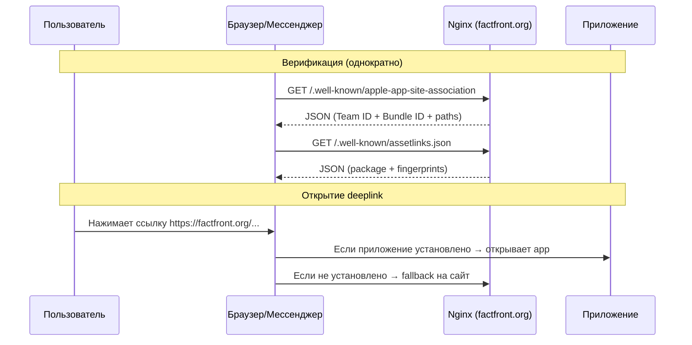
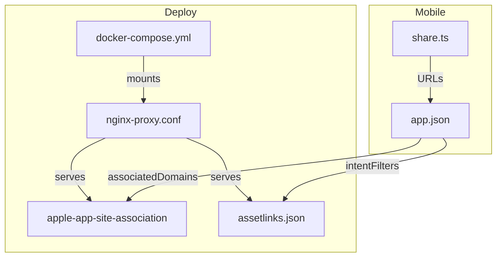

# Архитектура: Deeplinks

## Обзор

Universal Links (iOS) и App Links (Android) через домен `factfront.org`.

## Поток данных

## Компоненты

## Решения по путям deeplink

Для MVP — один универсальный путь `/*` который открывает приложение. Конкретные маршруты (типа `/fact/123`) можно добавить позже.
