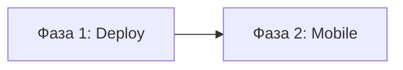

# План: Deeplinks

## Граф зависимостей

## Фаза 1: Nginx + verification-файлы
- **Область:** deploy
- **Зависит от:** нет
- **Файлы:**
  - `deploy/prod/seo/.well-known/apple-app-site-association` (новый)
  - `deploy/prod/seo/.well-known/assetlinks.json` (новый)
  - `deploy/prod/nginx-proxy.conf` (добавить location /.well-known/)
- **Что сделать:**
  1. Создать `deploy/prod/seo/.well-known/apple-app-site-association` с appID `97J2MY855C.com.factfront.app`
  2. Создать `deploy/prod/seo/.well-known/assetlinks.json` для `com.factfront.app`
  3. Добавить в nginx-proxy.conf location `/.well-known/` с alias на `/usr/share/nginx/seo/.well-known/` и `application/json` Content-Type
- **Критерии приёмки:**
  - [x] Файлы созданы с правильным содержимым
  - [x] Nginx location добавлен
- **Коммит:** `feat(deploy): добавить файлы верификации deeplinks`

## Фаза 2: Mobile — deeplinks + share URLs
- **Область:** mobile
- **Зависит от:** Фаза 1 (логически, но код независим)
- **Файлы:**
  - `mobile/app.json` (associatedDomains, intentFilters)
  - `mobile/src/utils/share.ts` (обновить URLs)
- **Что сделать:**
  1. В app.json iOS: добавить `"associatedDomains": ["applinks:factfront.org"]`
  2. В app.json Android: добавить `"intentFilters"` для `https://factfront.org`
  3. В share.ts: заменить все `factfront.app` и `https://factfront.app` на `https://factfront.org`
- **Критерии приёмки:**
  - [x] associatedDomains добавлен
  - [x] intentFilters добавлен
  - [x] Все share URLs используют https://factfront.org
  - [x] `npx tsc --noEmit` проходит
  - [x] `npm run lint` проходит
- **Коммит:** `feat(mobile): добавить поддержку deeplinks и обновить ссылки шеринга`
