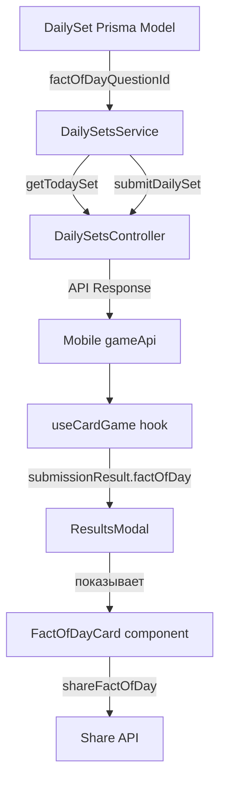
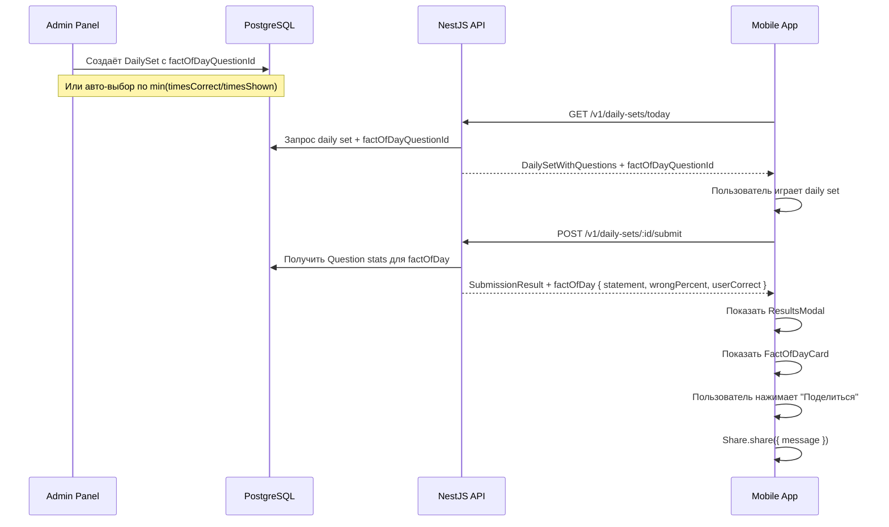

# Архитектура: Факт дня

## Компоненты

## Поток данных

## Авто-выбор факта дня

Если `factOfDayQuestionId` не задан админом — сервер автоматически выбирает вопрос из daily set с наименьшим `timesCorrect / timesShown` (самый трудный = самый контринтуитивный). Если статистики нет (timesShown = 0) — выбирается первый вопрос.
