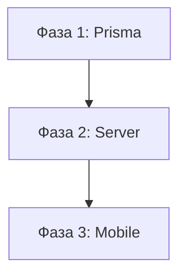

# План реализации: Факт дня

## Граф зависимостей

---

## Фаза 1: Prisma — добавить factOfDayQuestionId

- **Область:** prisma
- **Зависит от:** нет
- **Файлы:**
  - `server/prisma/schema.prisma`
- **Что сделать:**
  1. Добавить `factOfDayQuestionId String?` в модель `DailySet`
  2. Создать миграцию: `npx prisma migrate dev --name add-fact-of-day-question-id`
  3. Регенерировать клиент: `npx prisma generate`
- **Критерии приёмки:**
  - [ ] Поле есть в schema.prisma
  - [ ] Миграция создана и применена
  - [ ] `npx prisma generate` успешен
- **Коммит:** `feat(prisma): добавить поле factOfDayQuestionId в DailySet`

---

## Фаза 2: Server — логика факта дня

- **Область:** server
- **Зависит от:** Фаза 1
- **Файлы:**
  - `server/src/modules/daily-sets/daily-sets.service.ts` — добавить factOfDay в submitDailySet ответ + авто-выбор
  - `server/src/modules/daily-sets/daily-sets.controller.ts` — нет изменений (расширяется ответ сервиса)
  - `server/src/modules/admin/daily-sets/dto/create-daily-set.dto.ts` — добавить factOfDayQuestionId
  - `server/src/modules/admin/daily-sets/dto/update-daily-set.dto.ts` — добавить factOfDayQuestionId
  - `server/src/modules/admin/daily-sets/admin-daily-sets.service.ts` — сохранять factOfDayQuestionId при create/update
- **Что сделать:**
  1. В `CreateDailySetDto` / `UpdateDailySetDto` добавить `factOfDayQuestionId` с `@IsOptional()`, `@IsString()`, `@ApiPropertyOptional()`
  2. В `AdminDailySetsService.create()` / `update()` — передавать `factOfDayQuestionId` в Prisma, валидировать принадлежность к сету
  3. В `DailySetsService.getTodaySet()` — включить `factOfDayQuestionId` в ответ
  4. В `DailySetsService.submitDailySet()`:
     - Определить factOfDay questionId (из БД или авто-выбор по min timesCorrect/timesShown)
     - Получить Question с stats
     - Определить userCorrect из dto.results
     - Вернуть `factOfDay: { questionId, statement, statementEn, isTrue, wrongPercent, userCorrect }`
- **Критерии приёмки:**
  - [ ] submitDailySet возвращает factOfDay
  - [ ] Авто-выбор работает при factOfDayQuestionId = null
  - [ ] factOfDay = null для fallback sets
  - [ ] Admin DTO принимают factOfDayQuestionId
  - [ ] `npm run build` проходит
  - [ ] `npm test` проходит
- **Коммит:** `feat(server): добавить факт дня в daily sets`

---

## Фаза 3: Mobile — UI факта дня

- **Область:** mobile
- **Зависит от:** Фаза 2
- **Файлы:**
  - `mobile/src/features/game/types.ts` — расширить SubmissionResult
  - `mobile/src/shared/types/daily-set.ts` — добавить factOfDayQuestionId
  - `mobile/src/features/game/components/FactOfDayCard.tsx` — **новый** компонент
  - `mobile/app/modal/results.tsx` — добавить FactOfDayCard
  - `mobile/src/utils/share.ts` — добавить shareFactOfDay()
  - `mobile/src/i18n/locales/ru.json` — добавить factOfDay keys
  - `mobile/src/i18n/locales/en.json` — добавить factOfDay keys
- **Что сделать:**
  1. Расширить типы: `SubmissionResult.factOfDay`, `DailySetWithQuestions.factOfDayQuestionId`
  2. Добавить i18n ключи в оба языка
  3. Создать `FactOfDayCard` — карточка с statement, wrongPercent, userCorrect статус, кнопка шеринга
  4. В `results.tsx` — показать `FactOfDayCard` между streak и DailyResultCard если есть factOfDay
  5. Добавить `shareFactOfDay()` — формирует текст из задачи
- **Критерии приёмки:**
  - [ ] FactOfDayCard отображается при наличии factOfDay
  - [ ] Не отображается при factOfDay = null
  - [ ] Шеринг открывает системный share sheet
  - [ ] i18n работает для RU и EN
  - [ ] `npm run lint` проходит
- **Коммит:** `feat(mobile): добавить карточку факт дня на экран результатов`
