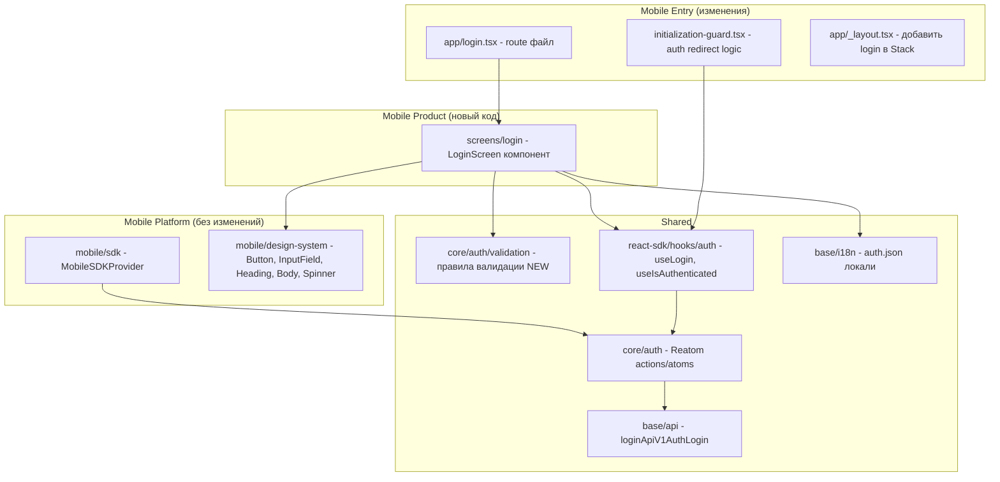
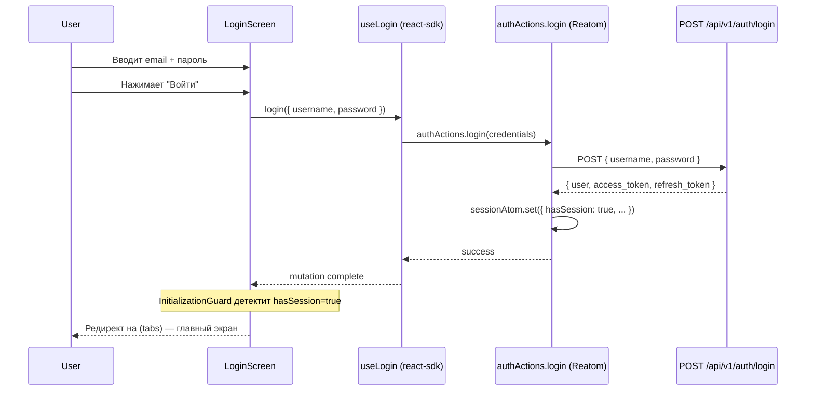
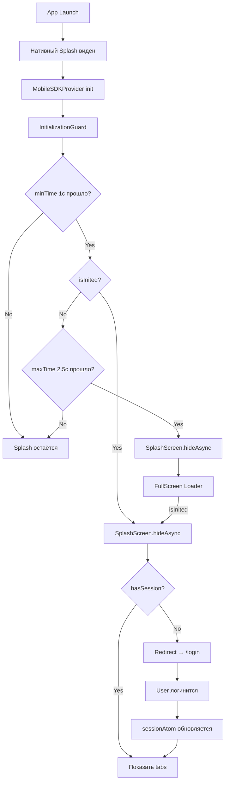

# Архитектура: Экран логина (mobile)

## Обзор по Figma

Экран состоит из:

- Верхняя часть — пустая область (позже фоновая картинка на всю высоту и ширину экрана), иконки помощи и языка в правом верхнем углу
- Нижняя часть — карточка с формой логина:
  - Логотип + "Small Chat"
  - Поле "Логин" (email, с иконкой пользователя)
  - Поле "Пароль" (с иконкой замка и toggle видимости)
  - Кнопка "Войти"

## Затрагиваемые слои



## Компонентная структура

```
LoginScreen
├── SafeAreaView (фон — пока пустой, позже картинка)
├── Header (правый верхний угол)
│   ├── HelpIcon (вопросик)
│   └── LanguageIcon (глобус)
├── KeyboardAvoidingView
│   └── LoginCard (карточка внизу экрана)
│       ├── Logo + "Small Chat" (Heading)
│       ├── LoginForm
│       │   ├── DSComponents.InputField (email/username)
│       │   ├── DSComponents.InputField (password, secureTextEntry + toggle)
│       │   └── DSComponents.Button ("Войти")
│       └── Error message (если есть)
```

## Потоки данных



## Auth redirect flow


