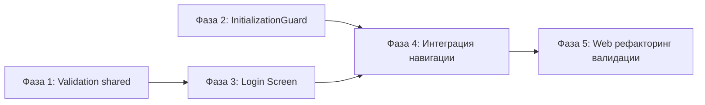

# План реализации: Экран логина (mobile)

## Граф зависимостей фаз

---

## Фаза 1: Правила валидации в shared

- **Слой:** shared
- **Зависит от:** нет
- **Файлы:**
  - `platforms/shared/modules/core/auth/validation/login.ts` (новый)
  - `platforms/shared/modules/core/auth/validation/index.ts` (новый)
  - `platforms/shared/modules/core/auth/index.ts` (изменение — добавить реэкспорт)
- **Что сделать:**
  - Создать `validation/login.ts` с `loginValidationRules` (username: required + pattern, password: required + minLength)
  - Создать `validation/index.ts` с `createEntryPoint` по паттерну `actions/index.ts`
  - Добавить `export { validation as authValidation } from './validation'` в корневой `index.ts`
- **Критерии приёмки:**
  - [ ] Модуль экспортирует `authValidation.login` с правилами
  - [ ] Структура соответствует паттерну других папок в `core/auth/`
  - [ ] Нет платформозависимого кода, нет i18n
- **Коммит:** `feat(auth): добавить правила валидации логина в shared`

---

## Фаза 2: InitializationGuard с splash + auth redirect

- **Слой:** mobile entry
- **Зависит от:** нет
- **Файлы:**
  - `platforms/mobile/entries/small-chat/src/initialization/initialization-guard.tsx` (изменение)
- **Что сделать:**
  - Добавить логику splash screen (expo-splash-screen): min 1с, max 2.5с
  - Добавить `useIsInited` и `useIsAuthenticated` из react-sdk
  - При `!isInited` после 2.5с — fullscreen loader (Spinner из design system)
  - При `!isAuthenticated` — `<Redirect href="/login" />`
  - При `isAuthenticated` — рендерить children
- **Критерии приёмки:**
  - [ ] Нативный splash показывается минимум 1с
  - [ ] После 2.5с splash скрывается, показывается loader если не готовы
  - [ ] Авторизованный пользователь → приложение
  - [ ] Неавторизованный → redirect на /login
- **Коммит:** `feat(mobile): добавить auth guard и splash логику в InitializationGuard`

---

## Фаза 3: Экран логина (LoginScreen)

- **Слой:** mobile product
- **Зависит от:** Фаза 1
- **Файлы:**
  - `platforms/mobile/products/small-chat/screens/login/index.ts` (новый)
  - `platforms/mobile/products/small-chat/screens/login/login-screen.tsx` (новый)
  - `platforms/mobile/products/small-chat/screens/login/package.json` (новый)
- **Что сделать:**
  - Создать пакет `@small-chat-mobile-screens/login`
  - Реализовать `LoginScreen`:
    - SafeAreaView с фоном (View, подготовлен для будущей ImageBackground)
    - Header с иконками-заглушками (?, глобус) в правом верхнем углу
    - KeyboardAvoidingView
    - Карточка внизу экрана: логотип + "Small Chat", форма логина
    - Форма: `DSComponents.InputField` (email + password) с `react-hook-form` + `rules` из `authValidation.login`
    - `DSComponents.Button` "Войти"
    - `useLogin` из react-sdk для отправки
    - Обработка ошибок (API error display)
    - Loading state (Spinner в кнопке)
    - i18n для всех текстов
- **Критерии приёмки:**
  - [ ] Экран соответствует Figma дизайну
  - [ ] Валидация через shared правила + i18n сообщения
  - [ ] Login вызывает `useLogin` и обрабатывает success/error
  - [ ] Клавиатура не перекрывает форму
  - [ ] Пакет `@small-chat-mobile-screens/login` с правильными зависимостями
- **Коммит:** `feat(mobile): добавить экран логина`

---

## Фаза 4: Интеграция навигации

- **Слой:** mobile entry
- **Зависит от:** Фаза 2, Фаза 3
- **Файлы:**
  - `platforms/mobile/entries/small-chat/app/login.tsx` (новый)
  - `platforms/mobile/entries/small-chat/app/_layout.tsx` (изменение)
  - `platforms/mobile/entries/small-chat/package.json` (изменение — добавить зависимость)
- **Что сделать:**
  - Создать `app/login.tsx` — route файл, реэкспорт `LoginScreen`
  - Добавить `<Stack.Screen name="login" />` в `_layout.tsx` (без header)
  - Добавить `@small-chat-mobile-screens/login` в зависимости entry
- **Критерии приёмки:**
  - [ ] Route `/login` доступен
  - [ ] Login screen не показывает navigation header
  - [ ] Неавторизованный пользователь видит login screen
  - [ ] После успешного логина — переход на (tabs)
- **Коммит:** `feat(mobile): интегрировать экран логина в навигацию`

---

## Фаза 5: Рефакторинг валидации web LoginForm

- **Слой:** web product
- **Зависит от:** Фаза 1
- **Файлы:**
  - `platforms/web/products/small-chat/src/components/forms/LoginForm.tsx` (изменение)
- **Что сделать:**
  - Импортировать `authValidation` из `@platforms-core/auth`
  - Заменить inline zod правила на `authValidation.login.username.pattern` и `authValidation.login.password.minLength`
  - Убедиться что поведение не изменилось
- **Критерии приёмки:**
  - [ ] LoginForm использует правила из shared
  - [ ] Валидация работает как раньше
  - [ ] Нет дублирования правил
- **Коммит:** `refactor(web): перевести LoginForm на shared правила валидации`
