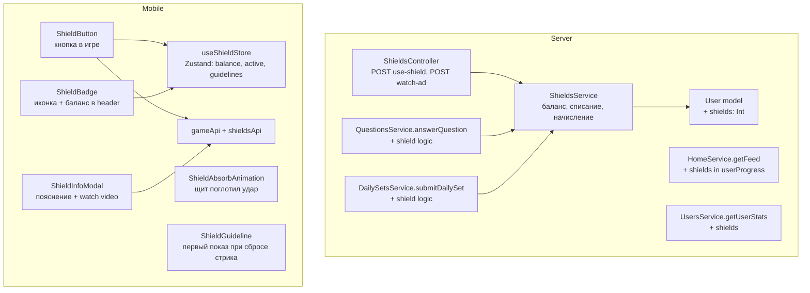
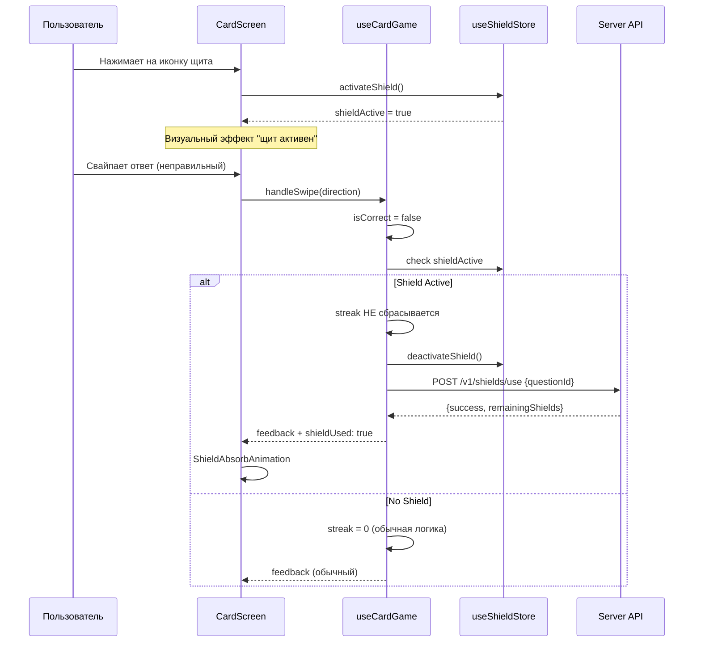
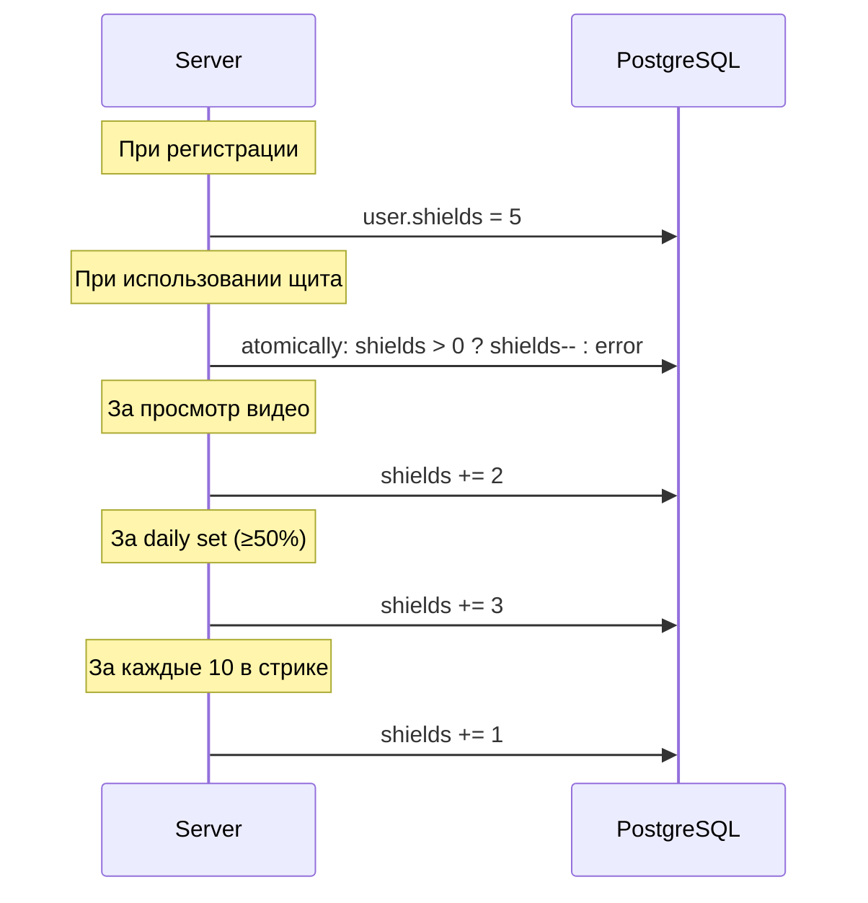

# Архитектура: Валюта "Щит"

## Компоненты

```mermaid
graph TB
    subgraph Server
        PrismaUser[User model<br/>+ shields: Int]
        ShieldsService[ShieldsService<br/>баланс, списание, начисление]
        ShieldsController[ShieldsController<br/>POST use-shield, POST watch-ad]
        QuestionsService[QuestionsService.answerQuestion<br/>+ shield logic]
        DailySetsService[DailySetsService.submitDailySet<br/>+ shield logic]
        HomeService[HomeService.getFeed<br/>+ shields in userProgress]
        UsersService[UsersService.getUserStats<br/>+ shields]
    end

    subgraph Mobile
        ShieldStore[useShieldStore<br/>Zustand: balance, active, guidelines]
        ShieldBadge[ShieldBadge<br/>иконка + баланс в header]
        ShieldButton[ShieldButton<br/>кнопка в игре]
        ShieldModal[ShieldInfoModal<br/>пояснение + watch video]
        ShieldAnimation[ShieldAbsorbAnimation<br/>щит поглотил удар]
        ShieldGuideline[ShieldGuideline<br/>первый показ при сбросе стрика]
        GameApi[gameApi + shieldsApi]
    end

    ShieldsController --> ShieldsService
    ShieldsService --> PrismaUser
    QuestionsService --> ShieldsService
    DailySetsService --> ShieldsService

    ShieldButton --> ShieldStore
    ShieldButton --> GameApi
    ShieldBadge --> ShieldStore
    ShieldModal --> GameApi
```

## Поток данных: использование щита

```mermaid
sequenceDiagram
    participant U as Пользователь
    participant Card as CardScreen
    participant Hook as useCardGame
    participant Store as useShieldStore
    participant API as Server API

    U->>Card: Нажимает на иконку щита
    Card->>Store: activateShield()
    Store-->>Card: shieldActive = true
    Note over Card: Визуальный эффект "щит активен"

    U->>Card: Свайпает ответ (неправильный)
    Card->>Hook: handleSwipe(direction)
    Hook->>Hook: isCorrect = false
    Hook->>Store: check shieldActive
    alt Shield Active
        Hook->>Hook: streak НЕ сбрасывается
        Hook->>Store: deactivateShield()
        Hook->>API: POST /v1/shields/use {questionId}
        API-->>Hook: {success, remainingShields}
        Hook-->>Card: feedback + shieldUsed: true
        Card->>Card: ShieldAbsorbAnimation
    else No Shield
        Hook->>Hook: streak = 0 (обычная логика)
        Hook-->>Card: feedback (обычный)
    end
```

## Поток данных: начисление щитов

```mermaid
sequenceDiagram
    participant Server as Server
    participant DB as PostgreSQL

    Note over Server: При регистрации
    Server->>DB: user.shields = 5

    Note over Server: При использовании щита
    Server->>DB: atomically: shields > 0 ? shields-- : error

    Note over Server: За просмотр видео
    Server->>DB: shields += 2

    Note over Server: За daily set (≥50%)
    Server->>DB: shields += 3

    Note over Server: За каждые 10 в стрике
    Server->>DB: shields += 1
```
