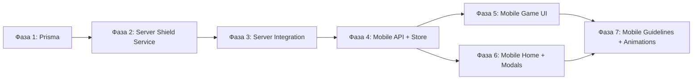

# План реализации: Валюта "Щит"

## Граф зависимостей

---

## Фаза 1: Prisma — добавить поле shields в User
- **Область:** prisma
- **Зависит от:** нет
- **Файлы:**
  - `server/prisma/schema.prisma`
  - `server/prisma/migrations/*/migration.sql` (auto)
- **Что сделать:**
  1. Добавить `shields Int @default(0)` в модель User
  2. Создать миграцию: `npx prisma migrate dev --name add-user-shields`
  3. Миграция для существующих: SQL `UPDATE "User" SET shields = 5 WHERE shields = 0`
  4. Regenerate Prisma client
- **Критерии приёмки:**
  - [ ] Поле `shields` существует в User
  - [ ] Миграция применена без ошибок
  - [ ] Prisma client сгенерирован
  - [ ] Существующие пользователи получат 5 щитов
- **Коммит:** `feat(prisma): добавить поле shields в модель User`

---

## Фаза 2: Server — ShieldsService + Controller
- **Область:** server
- **Зависит от:** Фаза 1
- **Файлы:**
  - `server/src/modules/shields/shields.module.ts`
  - `server/src/modules/shields/shields.service.ts`
  - `server/src/modules/shields/shields.controller.ts`
  - `server/src/modules/shields/dto/use-shield.dto.ts`
  - `server/src/modules/shields/dto/reward-shield.dto.ts`
- **Что сделать:**
  1. Создать модуль shields с controller и service
  2. `ShieldsService`:
     - `useShield(userId, questionId)` — атомарное списание (UPDATE WHERE shields > 0, throw BadRequestException if 0)
     - `addShields(userId, amount, source)` — начисление
     - `getBalance(userId)` — получить баланс
     - `initializeShields(userId)` — установить 5 для нового пользователя
  3. `ShieldsController`:
     - `POST /v1/shields/use` — DeviceAuthGuard, UseShieldDto
     - `POST /v1/shields/reward` — DeviceAuthGuard, RewardShieldDto, rate limit
     - Swagger decorators: @ApiTags, @ApiOperation, @ApiResponse
  4. Зарегистрировать ShieldsModule в app.module.ts
- **Критерии приёмки:**
  - [ ] Атомарное списание через raw SQL
  - [ ] Rate limit на /reward (Throttle decorator)
  - [ ] Swagger docs
  - [ ] Сборка без ошибок
- **Коммит:** `feat(server): добавить модуль shields с API`

---

## Фаза 3: Server — интеграция shields в game логику
- **Область:** server
- **Зависит от:** Фаза 2
- **Файлы:**
  - `server/src/modules/questions/questions.service.ts`
  - `server/src/modules/questions/dto/answer-question.dto.ts`
  - `server/src/modules/daily-sets/daily-sets.service.ts`
  - `server/src/modules/daily-sets/dto/submit-daily-set.dto.ts`
  - `server/src/modules/home/home.service.ts`
  - `server/src/modules/users/users.service.ts`
  - `server/src/modules/users/users.controller.ts` (register → init shields)
- **Что сделать:**
  1. `answerQuestion`: добавить `useShield` в DTO, если неправильный ответ + useShield + shields > 0 → streak не сбрасывается, shields -= 1. Добавить `shieldUsed`, `remainingShields` в response
  2. `submitDailySet`: обработка shieldUsed в results, бонус +3 shields при ≥50% правильных
  3. Streak milestone: +1 shield за каждые кратные 10 в currentAnswerStreak
  4. `register`: вызвать initializeShields (shields = 5)
  5. `home.getFeed`: добавить shields в userProgress
  6. `getUserStats`: добавить shields в ответ
- **Критерии приёмки:**
  - [ ] Streak не сбрасывается при useShield + shields > 0
  - [ ] +3 shields за daily set ≥50%
  - [ ] +1 shield за кратные 10 streak
  - [ ] shields в home feed и user stats
  - [ ] Build + tests pass
- **Коммит:** `feat(server): интегрировать shields в игровую логику`

---

## Фаза 4: Mobile — API + Shield Store
- **Область:** mobile
- **Зависит от:** Фаза 3
- **Файлы:**
  - `mobile/src/features/shield/api/shieldsApi.ts`
  - `mobile/src/features/shield/hooks/useShields.ts`
  - `mobile/src/features/shield/types.ts`
  - `mobile/src/features/shield/index.ts`
  - `mobile/src/features/game/stores/useGameStore.ts` (добавить shieldActive)
  - `mobile/src/i18n/locales/ru.json` (ключи для shield)
  - `mobile/src/i18n/locales/en.json` (ключи для shield)
- **Что сделать:**
  1. Создать `shieldsApi`: `useShield(questionId)`, `rewardShield()`
  2. React Query hook `useShields()` — баланс из home feed (не отдельный запрос)
  3. Добавить `shieldActive: boolean` + `activateShield()` / `deactivateShield()` в useGameStore
  4. Добавить i18n ключи: `shield.title`, `shield.description`, `shield.watchVideo`, `shield.noShields`, `shield.earned`, `shield.dailyBonus`, `shield.streakGuideline`, `shield.shieldGuideline`
- **Критерии приёмки:**
  - [ ] API functions typed correctly
  - [ ] i18n ключи в обоих языках
  - [ ] shieldActive state в game store
  - [ ] Lint passes
- **Коммит:** `feat(mobile): добавить shield API, store и i18n`

---

## Фаза 5: Mobile — Shield UI в игре
- **Область:** mobile
- **Зависит от:** Фаза 4
- **Файлы:**
  - `mobile/src/features/shield/components/ShieldButton.tsx`
  - `mobile/src/features/shield/components/ShieldWatchVideoModal.tsx`
  - `mobile/src/features/game/components/GameHeader.tsx` (layout change)
  - `mobile/src/features/game/hooks/useCardGame.ts` (shield logic)
  - `mobile/app/game/card.tsx` (shield integration)
- **Что сделать:**
  1. `ShieldButton`: иконка щита + баланс, по нажатию активация. Если 0 — показать модалку видео
  2. `ShieldWatchVideoModal`: "Щиты закончились. Посмотри видео за +2 щита"
  3. Изменить `GameHeader` — добавить ShieldButton справа (или отдельно справа над карточками)
  4. В `useCardGame.handleSwipe`: если shieldActive + !isCorrect → streak не сбрасывается, вызвать API useShield, deactivateShield
  5. Интегрировать в `card.tsx` — ShieldButton над карточками справа
- **Критерии приёмки:**
  - [ ] ShieldButton отображается и реагирует
  - [ ] Shield активация/деактивация
  - [ ] Streak не сбрасывается при использовании
  - [ ] Модалка при 0 баланса
  - [ ] Lint passes
- **Коммит:** `feat(mobile): добавить UI щита в экран игры`

---

## Фаза 6: Mobile — Shield в Home + Info Modal + Daily Set
- **Область:** mobile
- **Зависит от:** Фаза 4
- **Файлы:**
  - `mobile/src/features/shield/components/ShieldBadge.tsx`
  - `mobile/src/features/shield/components/ShieldInfoModal.tsx`
  - `mobile/app/(tabs)/home/index.tsx` (header)
  - `mobile/app/(tabs)/home/index.tsx` (daily set bonus text)
- **Что сделать:**
  1. `ShieldBadge`: иконка 🛡️ + count, по нажатию → открыть ShieldInfoModal
  2. `ShieldInfoModal`: описание щитов + кнопка "Посмотреть видео за +2"
  3. В home header: добавить ShieldBadge рядом с StreakBadge
  4. В Hero Daily Set card: добавить текст "+3 🛡️ за ≥50% правильных"
- **Критерии приёмки:**
  - [ ] Shield badge в home header
  - [ ] Модалка с описанием
  - [ ] Rewarded video начисляет +2
  - [ ] Daily set bonus текст
  - [ ] Lint passes
- **Коммит:** `feat(mobile): добавить отображение щитов на главном экране`

---

## Фаза 7: Mobile — Animations + Guidelines
- **Область:** mobile
- **Зависит от:** Фаза 5, Фаза 6
- **Файлы:**
  - `mobile/src/features/shield/components/ShieldAbsorbAnimation.tsx`
  - `mobile/src/features/shield/components/ShieldGuideline.tsx`
  - `mobile/src/stores/useAppStore.ts` (guideline flags)
  - `mobile/app/game/card.tsx` (animation integration)
  - `mobile/src/features/game/hooks/useCardGame.ts` (guideline trigger)
- **Что сделать:**
  1. `ShieldAbsorbAnimation`: анимация "щит поглотил удар" при неправильном ответе с щитом. Reanimated: scale bounce + glow effect + fade
  2. `ShieldGuideline`: OverlayModal с двумя шагами:
     - Шаг 1: "Стрик увеличивает очки! Чем больше серия, тем больше бонус. Неправильный ответ сбросит стрик"
     - Шаг 2: "Используй щит чтобы защитить стрик! Нажми на 🛡️ перед ответом"
  3. Добавить `hasSeenStreakShieldGuideline` в useAppStore (persisted)
  4. Триггер: в useCardGame — если streak был 0, стал > 0, и guideline не показан → показать
  5. Интегрировать ShieldAbsorbAnimation в card.tsx
- **Критерии приёмки:**
  - [ ] Анимация проигрывается при shield use
  - [ ] Guideline показывается один раз
  - [ ] Flag persisted через AsyncStorage
  - [ ] Lint passes
- **Коммит:** `feat(mobile): добавить анимации и гайдлайн для щита`
